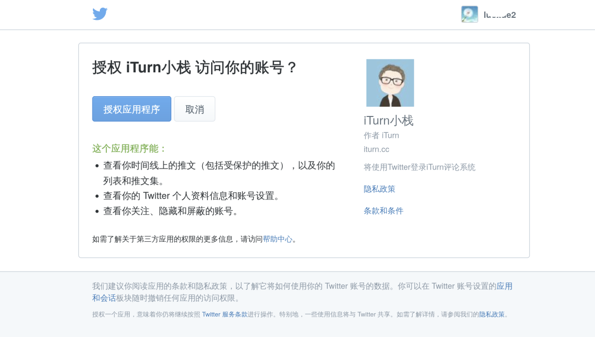

[walinejs/auth][walinejs/auth] is a project that provides social login authentication services for [walinejs/waline][walinejs/waline], including [GitHub][GitHub], [Twitter][Twitter], [Facebook][Facebook], [Google][Google], [Weibo][Weibo], [QQ][QQ].

This project adds Docker deployment to [walinejs/auth][walinejs/auth] and modifies the data storage to sqlite3.

If you want to display your website's relevant information when users login, as shown in the following image, you can use this project to privately deploy the authentication service through Docker.



# Docker deployment：
```yaml
version: '3'
services:
  waline-auth:
    build: ./
    ports:
      - 8081:8081
    volumes:
      - /path/to/db:/db
    environment:
      GITHUB_ID: xxxxxxx
      GITHUB_SECRET: xxxxxx
      TWITTER_ID: xxxxx
      TWITTER_SECRET: xxxxxxxxx
```
Please modify the ports,volumes and environment to your own values.

# Explanation of Environment Variables

### GitHub

`GITHUB_ID` and `GITHUB_SECRET` enviroment variables are required.

- Redirect URL: `<a href="<serverUrl>/github?redirect=&state=">Login with GitHub</a>`
- Get user info: `GET <serverUrl>/github?code=`

### Twitter

`TWITTER_ID` and `TWITTER_SECRET` environment variables are required.

- Redirect URL: `<a href="<serverUrl>/twitter?redirect=&state=">Login with Twitter</a>`
- Get user info: `GET <serverUrl>/twitter?oauth_token=&oauth_verifier`
### Facebook

`FACEBOOK_ID` and `FACEBOOK_SECRET` enviroment variables are required.

- Redirect URL: `<a href="<serverUrl>/facebook?redirect=&state=">Login with Facebook</a>`
- Get user info: `GET <serverUrl>/facebook?code=`

### Google

`GOOGLE_ID` and `GOOGLE_SECRET` enviroment variables are required.

- Redirect URL: `<a href="<serverUrl>/google?redirect=&state=">Login with Google</a>`
- Get user info: `GET <serverUrl>/google?code=`

### Weibo

`WEIBO_ID` and `WEIBO_SECRET` enviroment variables are required.

- Redirect URL: `<a href="<serverUrl>/weibo?redirect=&state=">Login with Weibo</a>`
- Get user info: `GET <serverUrl>/weibo?code=`

### QQ

`QQ_ID` and `QQ_SECRET` environment variables are required.

- Redirect URL: `<a href="<serverUrl>/qq?redirect=&state=">Login with QQ</a>`
- Get user info: `GET <serverUrl>/qq?code=`

# Nginx Proxy configuration

```nginx
location / {
    proxy_pass http://127.0.0.1:8081;
    proxy_http_version 1.1;
    proxy_set_header Upgrade $http_upgrade;
    proxy_set_header Connection "upgrade";
    proxy_set_header Host $http_host;
    proxy_set_header x-forwarded-proto $scheme;
    proxy_set_header X-Real-IP $remote_addr;
    proxy_set_header X-Forwarded-For$proxy_add_x_forwarded_for;
}
```

  [GitHub]: https://github.com
  [Twitter]: https://twitter.com
  [Facebook]: https://facebook.com
  [Google]: https://google.com
  [Weibo]: https://weibo.com
  [QQ]: https://qq.com

  [walinejs/waline]: https://github.com/walinejs/waline
  [walinejs/auth]:https://github.com/walinejs/auth